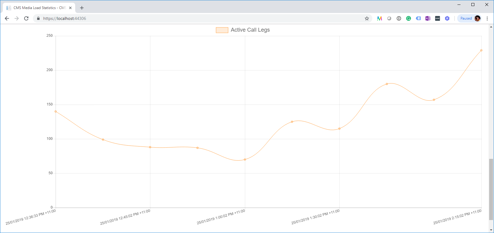

# Cms.Monitoring

Cms.Monitoring is a .Net Core solution consisting of two projects:

- **Cms.Monitoring.Agent** is a console application which communicates with the Cisco Meeting Server API to retrieve the *mediaProcessingLoad*, call, alarm, and database status data and writes it to a SQLite database. 
- **Cms.Monitoring.Web** is a ASP.NET Core application which represents the data saved by the Agent using [Chart.js](https://www.chartjs.org/) to display the data in a graph.

# Installation

## Agent Installation

The agent depends on the Cms.Lib project found here [Cms.Lib](https://github.com/jasonneurohr/Cms.Lib)

**Create the database:**

- Refer to [Getting Started with EF Core on ASP.NET Core with a New database](https://docs.microsoft.com/en-us/ef/core/get-started/aspnetcore/new-db?tabs=visual-studio)

**Deploy the agent:**

- Publish the project
- Deploy the published project to your desired host, e.g. a Windows Server with the .Net Core Hosting package installed
- Update the appsettings.json with the required details 

```json
{
  "dbPath": "Path to the CMS SQLite DB",
  "cmsServers": [
    {
      "address": "CMS FQDN",
      "port": "CMS Web Admin Port",
      "username": "CMS API User",
      "password": "CMS API User Password"
    }
  ],
  "logFilePath": "Log file path"
}
```

- Set up a Windows Scheduled Task or Linux cron job to execute the agent at the desired intervals

## Web Installation

Refer to [Host and deploy ASP.NET Core](https://docs.microsoft.com/en-us/aspnet/core/host-and-deploy/?view=aspnetcore-2.2) for your specific deployment needs.

- Publish the project and deploy to your desired host, e.g. a Windows Server with the .Net Core Hosting package installed
- Update the appsettings.json with the required details

```json
{
  "ConnectionStrings": {
    "DefaultConnection": "Data Source=Path to the CMS SQLite DB"
  },
  "Logging": {
    "LogLevel": {
      "Default": "Warning"
    }
  },
  "AllowedHosts": "*"
}
```

# Usage

Once the installation has been completed successfully, simply browse to the web interface at the location it was deployed to, and using the drop down box in the top right select the Cisco Meeting Server to display statistics for the last seven days.




# License

Cms.Monitoring is Open Source software and is released under the [Apache license 2.0](https://github.com/jasonneurohr/Cms.Monitoring/blob/master/LICENSE)

Charts.js is Open Source software and is released under the [MIT License](https://github.com/chartjs/Chart.js/blob/master/LICENSE.md)